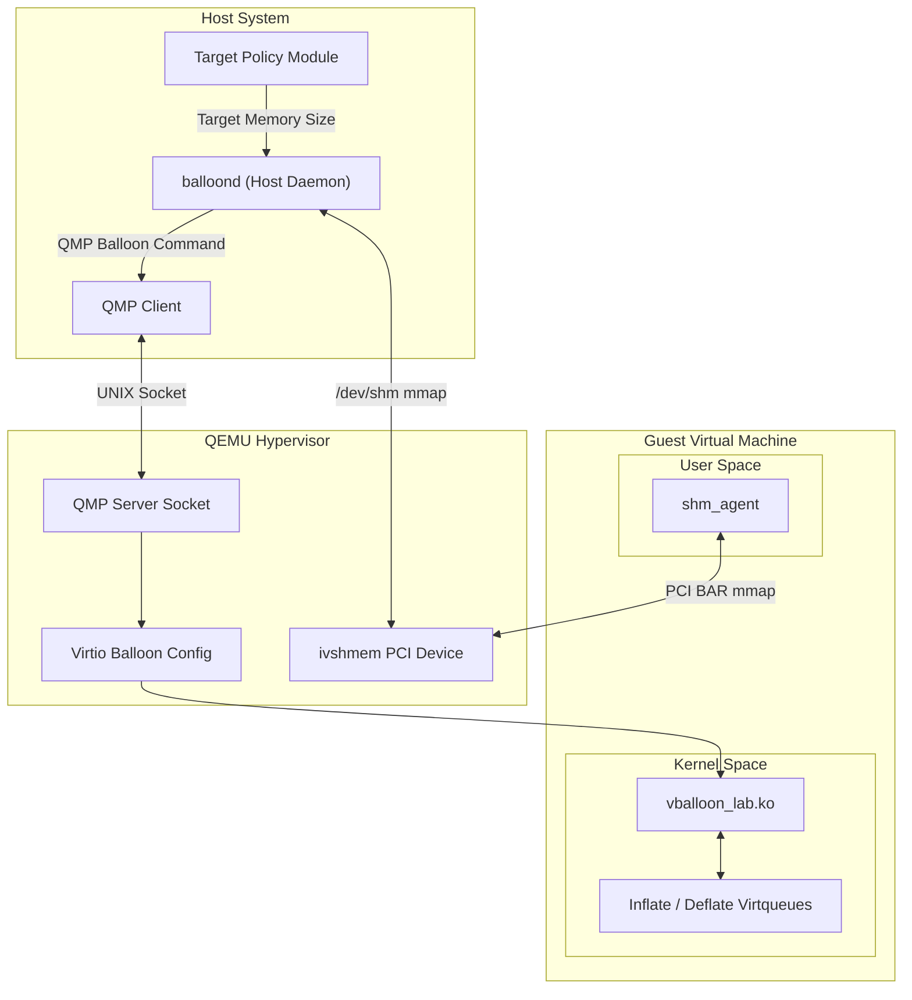

# System Architecture

## Overview

The `virtio-balloon` driver project implements a dynamic memory management system for virtual machines. It allows a host to dynamically reclaim memory from a guest VM or return memory to it, providing fine-grained control over resource allocation. 

Unlike standard QEMU balloon implementations that rely entirely on QMP polling, this system introduces a **Shared-Memory Control Plane** utilizing `ivshmem` (Inter-VM Shared Memory). This enables high-performance, predictable command signaling between the host daemon and the guest driver.

## Component Diagram

## Core Components

### 1. Host Daemon (`balloond`)
The host daemon is responsible for managing the desired memory target for the guest VM.
- **QMP Client:** Translates high-level memory targets into QEMU Machine Protocol (QMP) commands (`balloon` and `query-balloon`).
- **Shared-Memory Publisher:** Writes the target byte count and command sequence (`cmd_seq`) to the `ivshmem` region.
- **Replay Guard:** Maintains internal state to prevent publishing redundant commands if the target has not changed.

### 2. Shared Memory Bridge (`ivshmem`)
The project uses QEMU's `ivshmem-plain` to establish a zero-copy communication channel between the host and the guest.
- **Host Side:** Mapped as a standard POSIX shared memory object (e.g., `/dev/shm/balloon_ivshmem.bin`).
- **Guest Side:** Exposed as a PCI device (`1af4:1110`) where the guest can `mmap` the corresponding PCI BAR (Base Address Register).

### 3. Guest Kernel Driver (`vballoon_lab.ko`)
A custom Linux kernel module that acts as the virtio balloon device driver.
- **Inflate:** Allocates memory pages (`alloc_page`) and submits their Page Frame Numbers (PFNs) to the inflate virtqueue.
- **Deflate:** Pops pages from the ballooned list and returns them to the guest OS (`__free_page`).
- **Pressure Monitor:** Monitors the guest's free memory. If free memory drops below `pressure_min_free_mb`, it autonomously triggers a deflation to protect guest stability, temporarily overriding host targets.

### 4. Guest Agent (`shm_agent`)
A userspace bridge that completes the shared-memory contract.
- Maps the `ivshmem` PCI BAR.
- Monitors `cmd_seq` changes.
- Acknowledges command completion by updating `ack_seq` and reporting `actual_bytes`.

## Data Flow & State Machine

1. **Initiation:** Host determines a new target size and updates `target_bytes` + `cmd_seq` in shared memory.
2. **Hypervisor Signaling:** Host sends the `balloon` command over QMP.
3. **Guest Processing:** The guest driver reads the target from virtio config space and calculates the delta.
4. **Action:** The guest driver schedules worker threads to inflate or deflate.
5. **Acknowledgement:** The guest agent reads the new `cmd_seq`, updates `actual_bytes`, and sets `ack_seq = cmd_seq`.

## Future Architecture Plans
Currently, the shared memory handling in the guest is split between kernel space (for actual memory allocation) and user space (`shm_agent` for protocol acknowledgment). The ultimate architectural goal is to unify this by bringing the `ivshmem` BAR mapping directly into the `vballoon_lab` kernel module.
